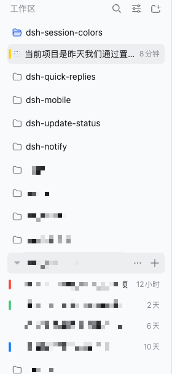
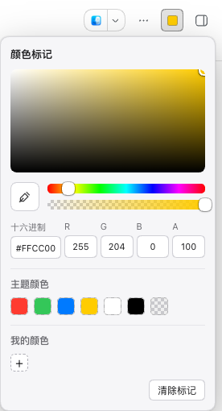
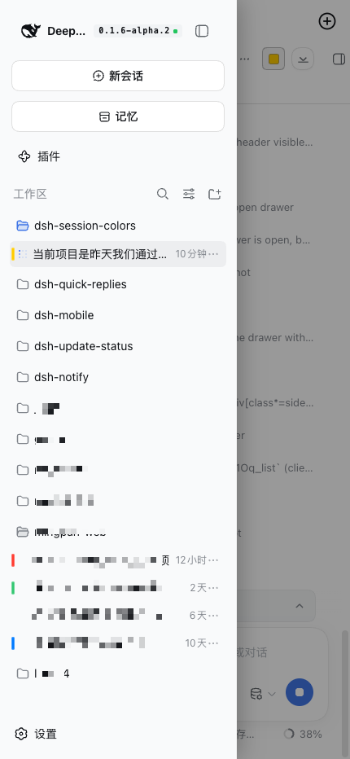

<h1 align="center">DSH 会话颜色标记</h1>

<p align="center">给任意会话上一个颜色，在侧栏一眼认出它。</p>

<p align="center">
  <a href="https://www.npmjs.com/package/@idoall/dsh-session-colors"></a>
  <a href="LICENSE"></a>
</p>

<p align="center"><a href="README.md">English</a> | 中文</p>

<p align="center">
  <a href="#功能">功能</a> ·
  <a href="#安装">安装</a> ·
  <a href="#使用">使用</a> ·
  <a href="#兼容性">兼容性</a> ·
  <a href="#跨设备与局域网">跨设备与局域网</a> ·
  <a href="#配置">配置</a> ·
  <a href="#故障排查">故障排查</a> ·
  <a href="#安全边界">安全边界</a> ·
  <a href="#限制">限制</a> ·
  <a href="#卸载">卸载</a> ·
  <a href="#开发">开发</a>
</p>

> **✅ 已支持 DSH `0.1.7-rc.1` —— 最新的 `0.1.7` 候选版本（RC）。** 已在运行中的 RC 实例上实测通过，同时也兼容 `0.1.7-alpha.2`；详见[兼容性](#兼容性)。

> DSH Session Colors 是 DeepSeek Harness 社区插件。它不修改 DSH 核心，也不改写任何会话或工作区数据：一个标记只是"会话 ID → 一个颜色"。

工作分散在多个工作区里，而工作区列表就是一堵长得差不多的标题墙。任务跑完之后，刚才那条会话就很难再找回来——状态点已经回到空闲，标题也只是二十个里的一个。**自己选的颜色，是让一行变得好认的最省事办法。**

<p align="center">
  
</p>

## 功能

- **会话行上的颜色标记**——行左侧内边距里的一小段色条，**刻意避开状态点**，所以"哪个跑完了"这个信号不会被盖掉。
- **系统风格的颜色选择器**——大色板、色相与透明度滑条、十六进制与 RGBA 输入、七个主题色、我的颜色，以及浏览器支持 `EyeDropper` 时的屏幕吸色。注册在会话头部的工具区，不占标题位置。
- **一处标记，处处可见。** 标记存在**宿主**而不是浏览器里，所以在电脑上选的颜色，手机上也能看到——局域网地址、隧道访问都算。
- **手机端同样显示。** 手机把侧栏变成抽屉，色块跟着抽屉走：抽屉滑进来时它一起移动，并且画在抽屉之上。
- **自动获取改动。** 页面重新可见时、以及每 20 秒会重读一次，别的设备改了颜色不用刷新就能看到。
- **绝不挡住界面。** 色块浮层**点击穿透**，并且按侧栏滚动容器裁剪；最坏情况只是色块不显示。
- **失败会说。** 读不到存储时，头部控制会显示 ⚠ 并给出原因，而不是装作"这个会话没有颜色"。

<p align="center">
  
</p>

## 安装

要求：

- 带 Web profile 的 DeepSeek Harness
- Node.js 20 或更新版本
- **已验证的 DSH 版本：`0.1.7-rc.1`**（最新候选版）与 `0.1.7-alpha.2`——插件 `0.1.4`（见[兼容性](#兼容性)）

```sh
dsh plugin --profile <profile> add @idoall/dsh-session-colors@latest
```

要按 DSH 版本精确对应，用[兼容性](#兼容性)表里的具体版本号。

要改插件本身就用目录安装：

```sh
dsh plugin --profile <profile> add link:/path/to/dsh-session-colors
```

然后在 profile 的 `cordis.patch.yml` 里给它一个数据目录（与其它需要持久化的插件做法一致，**插件不会去猜 profile 路径**）：

```yaml
- id: dsh-session-colors
  config:
    dataDir: /absolute/path/to/profiles/<profile>/data/dsh-session-colors
```

最后**重启 `dsh web`**（宿主半边只在启动时加载），再刷新 Web GUI。不配 `dataDir` 也能用，但标记只活在宿主进程的生命周期里。

## 使用

1. 打开要标记的会话。
2. 点会话头部的颜色控件（未设色时显示 🎨，设色后显示该颜色）。
3. 选一个颜色，或直接粘贴十六进制值。该会话在侧栏的行上会立刻出现色条。
4. 取消标记：再次打开选择器，点**清除标记**，或选主题色里那个透明色块。

在已标记的会话上打开选择器，会从它当前的颜色开始。颜色以 HSVA 保存，所以透明度能原样往返。

<p align="center">
  
</p>

## 兼容性

当前版本：插件 **`0.1.4`** 已针对 DeepSeek Harness **`0.1.7-rc.1`**（最新的 `0.1.7` 候选版本）与 **`0.1.7-alpha.2`** 验证。

| 插件版本 | 已验证的 DeepSeek Harness | npm 发布状态 | 该版本是什么 |
| --- | --- | --- | --- |
| **`0.1.4`** | **`0.1.7-rc.1`**（最新 RC）、`0.1.7-alpha.2` | `latest` | 确认 `0.1.7` 适配在候选版本上原样可用并加以声明。代码与 `0.1.3` 相同，升级无需迁移。 |
| `0.1.3` | `0.1.7-alpha.2` | 已发布 | 适配 DSH 0.1.7：会话 id 改从行自身的 `data-row-key` 读取（保留 fiber 回退），色块跟随 0.1.7 引入的 Web Animations 行滑动；宿主依赖按 0.1.7 对 link 插件的解析方式声明。 |
| `0.1.2` | `0.1.6-alpha.2` | 已发布 | 修掉折叠/展开工作区后色块停在旧位置约 20 秒：同一个 target 上第二次 `MutationObserver.observe()` 把 `childList` 监听顶掉了。 |
| `0.1.1` | `0.1.6-alpha.2` | 已发布 | 仅文档：打包进 npm 的 README 不再写"尚未发布"，并声明了市场截图。 |
| `0.1.0` | `0.1.6-alpha.2` | 已发布 | 首个版本：会话颜色标记、宿主侧存储、手机抽屉内可见 |

**`0.1.4` 支持 DSH `0.1.7-rc.1`，即最新的候选版本（RC）。** `0.1.7` 线改了侧栏行的 DOM 与 link 插件的依赖解析方式，而**`0.1.3` 已经把这两处吸收完毕**——`0.1.4` 确认同一份代码在 RC 上原样可用，并把 RC 记入声明。**从 `0.1.3` 升级无需任何迁移。** 仍在更旧的 DSH（含 `0.1.6-alpha.2`）上时，请继续用插件 **`0.1.2`**。更高的 DSH 版本不会被自动宣称为兼容。

- **已验证的 DeepSeek Harness** 是这个插件**实际跑过**的确切 DSH 版本。这份清单只有一个存放处——[`package.json`](package.json) 的 `dsh.compatibility.dshReleases`——并且有测试保证两个 README 的兼容性段落与它逐字一致、且落在 `peerDependencies` 声明的范围内。未列出的 DSH 版本**不会被宣称为兼容**。
- `peerDependencies` 声明的范围是 `>=0.1.7-alpha.2 <0.2.0`（`dsh-client-ui-layout` 与 `dsh-client-ui-conversation`），`dsh.engines.dsh` 把同一范围声明为宿主要求：这是**允许加载**的范围，不等于已验证。该范围**同时接纳** `0.1.7-alpha.2` 与 `0.1.7-rc.1`（只要范围里有比较符写了同一个 `major.minor.patch`，该版本的预发布就会被接纳），所以**刻意不为 RC 放宽**——放宽只会顺带接纳没人测过的版本。下界特意写成这个 alpha：`>=0.1.6-0 <0.2.0` 这样的范围两者都不接纳。
- DSH 0.1.7-rc.1 会在启动时校验这些 peer，范围不满足就**直接禁用该插件行**，所以范围写对已经不只是"声明问题"。
- `@deepseek-ai/schemastery` 声明为 **peer**，不是普通依赖：DSH 0.1.7 只把 link 插件的 **peer** 依赖解析到运行实例，所以用 `link:` 装入本目录时，普通依赖会让宿主半边 import 失败。
- DSH 升级快于插件时，插件本身不会因此报错：色块依赖 DSH 的行 DOM（见[限制](#限制)），所以 DSH 大改行结构时最坏的结果是**色块不再显示**，不会挡住点击。

## 跨设备与局域网

存储走插件**自己的** HTTP 路由（`GET`/`POST /plugins/dsh-session-colors/marks`），落盘到 profile 数据目录里的一个 JSON 文件。这是**有意为之**：

DSH 自带的用户设置服务**只对回环页面**做宿主持久化——

```js
persistence = $host.isLoopback ? "host" : "memory"
```

——所以用局域网地址或隧道打开的页面，设置 scope 会**永久不可用**，读不了也写不进。自有路由不受这条规则限制，这正是标记能跨设备的原因。局域网转发（`dsh-bridge`、`dsh-lan-proxy` 等）会把 `Host`/`Origin` 改写成回环并注入认证 cookie，所以经局域网进来的请求在 DSH 侧仍是回环，路由正常响应。

## 配置

| 字段 | 类型 | 含义 |
| --- | --- | --- |
| `dataDir` | 绝对路径 | `session-colors.json` 的写入位置。不填则标记只存在于进程内存。 |

标记是一个 JSON 文档：

```json
{
  "version": 1,
  "marks": {
    "session-0698599a-…": { "h": 211.3, "s": 1, "v": 1, "a": 1 }
  }
}
```

写入是**原子**的（先写临时文件，再 rename）。要清掉某个标记，用选择器里的**清除标记**，或直接从文件里删掉那一行。

## 故障排查

**手机上还是看不到颜色。**
先看设备跑的是哪个构建：

```js
document.querySelector('.dsh-sc-layer').dataset
// { dshScBuild, dshScStatus, dshScWritable, dshScMarks, dshScError }
```

`dshScBuild` 不是 `host-routes+animated-rows` 就是**客户端缓存**，刷新页面即可（客户端半边刷新即热重载，不需要重启 DSH）。`dshScStatus` 不是 `ready` 则是存储读不到，见下一条。

**头部控制显示 ⚠。**
表示读不到存储：`dshScError` 里有原因，`dshScWritable` 说明能不能写。宿主路由未注册（插件没被 profile 加载）或数据目录不可写时会这样。注意**这不是**"这个会话没有颜色"。

**局域网页面上功能不全。**
从 `0.1.0` 起本插件在局域网/隧道页面与回环页面行为一致（存储走自有路由）。如果你看到的是旧版那种"设置读不到"的表现，先确认装的是哪个版本。

**色块位置不对或消失。**
色块浮层靠 ARIA role 找会话行、靠行自身的 `data-row-key` 取会话 ID（取不到时回退到 React fiber）。DSH 大改侧栏结构后可能找不到行；此时色块会消失，但**不会影响点击**，因为浮层是点击穿透的。

## 安全边界

- 标记只保存**会话 ID 与颜色**，不写会话日志、标题、历史、状态、归档记录或工作区归属。
- **不创建、不复制、不移动、不重排任何会话**；标记不是会话数据的一部分。
- 色块浮层**从不接收指针事件**，并且按侧栏滚动容器裁剪：最坏情况只是色块不显示。
- 宿主路由复用 DSH 自带的鉴权栅栏（`connection.requestRejection`），写入另加同源检查。
- 插件不注册模型 Tool、不启动子进程、不访问网络。

## 限制

- **色块依赖 DSH 的行 DOM。** 它靠 ARIA role 找行、靠行自身的 `data-row-key` 取会话 ID（回退到 React 内部结构）。DSH 未来改版可能让色块不再显示；但**不会影响点击**。
- **标记属于单个 DSH 实例。** 它存在某个 profile 的数据目录里，两个独立的 DSH 服务之间不共享。
- **没有权限模型。** 凡是能访问该 profile 已鉴权路由的人，都能读写标记。
- **只有颜色。** 没有文字标签、图标或 emoji。

## 卸载

```sh
dsh plugin --profile <profile> remove @idoall/dsh-session-colors
```

重启 DSH 并刷新 Web GUI。数据目录里的 `session-colors.json` 不会被自动删除；不需要就自行删除。

## 开发

```sh
npm test        # 38 项：bundle 结构、存储、路由、跨设备、几何、文档一致性
```

浏览器半边是**手写的** `__ModuleLoader__` bundle——这是 DSH 客户端加载器接受的唯一格式。手写是刻意的：**没有构建步骤**，就不会有产物与目标 DSH 版本漂移的问题。

```
src/index.js       宿主半边：路由、JSON 存储、鉴权栅栏
src/client.js      浏览器半边：选择器、色块浮层、fetch 存储
tests/             两个半边的单元测试，外加文档一致性检查
docs/              设计记录（中文）与 README 截图
demos/             独立的选择器 HTML Demo
```

设计取舍与实测记录见 [docs/plugin-design.zh.md](docs/plugin-design.zh.md)；独立的选择器 Demo 见 [demos/session-color-mark-demo.html](demos/session-color-mark-demo.html)。

## 许可证

[MIT](LICENSE)
